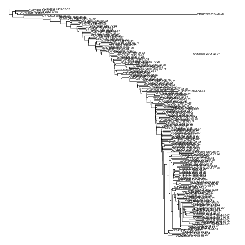
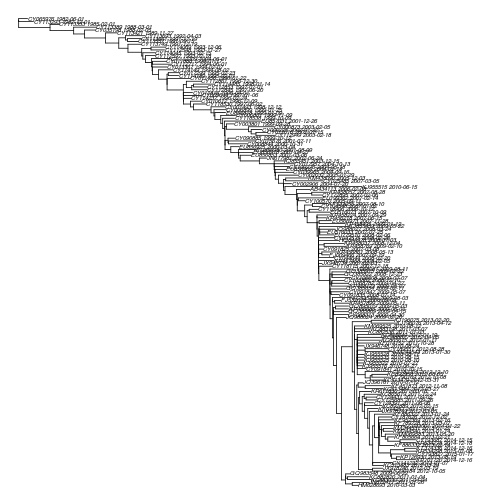
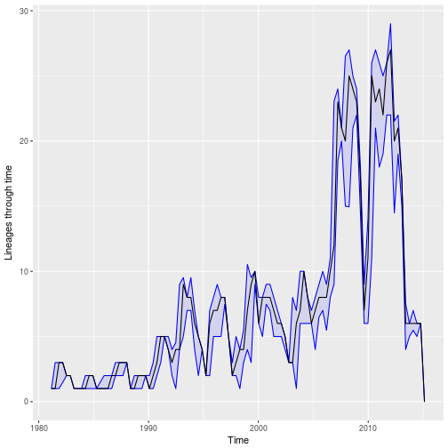

# treedater
`treedater` fits a strict or relaxed molecular clock to a phylogenetic tree and estimates evolutionary rates and times of common ancestry. The calendar time of each sample must be specified (possibly with bounds of uncertainty) and the length of the sequences used to estimate the tree. 

`treedater` uses heuristic search to optimise the TMRCAs of a phylogeny and the substitution rate. 
An uncorrelated relaxed molecular clock accounts for rate variation between lineages of the phylogeny which is parameterised using a Gamma-Poisson mixture model.

To cite:
* E.M. Volz and Frost, S.D.W. (2017) [Scalable relaxed clock phylogenetic dating](https://doi.org/10.1093/ve/vex025). Virus Evolution.


## basic usage

```
dater( tre, sts, s)
```

where 
* `tre` is an `ape::phylo` phylogeny, 
* `sts` is a named vector of sample times for each tip in `tre`
* `s` is the length of the genetic sequences used to estimate `tre`


# Demonstration with Influenza H3N2 HA 
This data set comprises 177 HA sequences collected over 35 years worldwide with known date of sampling.
We estimated a maximum likelihood tree using [iqtree](http://www.iqtree.org/). 
We will use the sample dates and ML tree to fit a molecular clock and estimate a dated phylogeny. 
First, load the tree (any method can be used to load a phylogeny into [ape::phylo format](http://ape-package.ird.fr/)): 

```r
require(treedater)
(tre <- read.tree( system.file( 'extdata', 'flu_h3n2_final_small.treefile', package='treedater') ))
```

```
## 
## Phylogenetic tree with 177 tips and 175 internal nodes.
## 
## Tip labels:
## 	HM628693_2010-03-03, KC883039_2011-04-04, KC882820_2011-01-04, GQ983548_2009-06-22, KF790184_2012-10-05, JX978746_2012-03-19, ...
## 
## Unrooted; includes branch lengths.
```

```r
seqlen <- 1698 # the length of the HA sequences
plot( tre , cex = .5, no.mar=T)
```


To fit the molecular clock, we will need the sample time for each lineage. That can be loaded here;

```r
sts <- readRDS( system.file( 'extdata', 'h3n2_small_sampleTimes.rds', package='treedater') ) 
head(sts ) 
```

```
## HM628693_2010-03-03 KC883039_2011-04-04 KC882820_2011-01-04 
##            2010.241            2011.329            2011.082 
## GQ983548_2009-06-22 KF790184_2012-10-05 JX978746_2012-03-19 
##            2009.545            2012.836            2012.288
```

```r
hist( sts , main = 'Time of sequence sampling') 
```


The basic usage of the treedater algorithm is as follows:

```r
(dtr <- dater( tre , sts, seqlen ))
```

```
## 
## Phylogenetic tree with 177 tips and 176 internal nodes.
## 
## Tip labels:
## 	HM628693_2010-03-03, KC883039_2011-04-04, KC882820_2011-01-04, GQ983548_2009-06-22, KF790184_2012-10-05, JX978746_2012-03-19, ...
## 
## Rooted; includes branch lengths.
## 
##  Time of common ancestor 
## 1978.87727493086 
## 
##  Time to common ancestor (before most recent sample) 
## 36.2432730143469 
## 
##  Mean substitution rate 
## 0.00310044840199018 
## 
##  Strict or relaxed clock 
## relaxed 
## 
##  Coefficient of variation of rates 
## 0.459231170789609
```
Note the returned value includes estimated substition rates and TMRCAs. 
The `dtr` object extends `ape::phylo`, so most of the methods that you can use in other R packages that use that format can also be used with a `dater` object. Lets plot the tree. 

```r
plot( dtr , no.mar=T, cex = .5 )
```



Note there are a couple of recent lineages that dont seem to fit well with the ladder-like topology. 

Lets see how long it takes to run treedater:

```r
rt0 <- Sys.time()
dtr <- dater( tre , sts, seqlen )
rt1 <- Sys.time()
rt1 - rt0 
```

```
## Time difference of 2.92461 secs
```


## Detecting and removing outliers / testing for relaxed clock
To find lineages that dont fit the molecular clock model very well, run

```r
outliers <- outlier.tips( dtr ) 
```

```
##                               q            p   loglik      rates
## KF805696_2013-02-27 0.007256927 4.099959e-05 -10.7988 0.01161863
##                     branch.length
## KF805696_2013-02-27     0.5169566
```
This returns a table in ascending order of how well the clock model fits that lineage. 
Now lineages could be selected for removal in various ways. 
Lets remove all tips that dont have a very high q-value :

```r
tre2 <- drop.tip( tre, rownames(outliers[outliers$q < .9,]) )
```

Now we can rerun `dater` with the reduced tree:

```r
(dtr2 <- dater(tre2, sts, seqlen ) )
```

```
## 
## Phylogenetic tree with 165 tips and 164 internal nodes.
## 
## Tip labels:
## 	HM628693_2010-03-03, KC883039_2011-04-04, KC882820_2011-01-04, GQ983548_2009-06-22, KF790184_2012-10-05, JX978746_2012-03-19, ...
## 
## Rooted; includes branch lengths.
## 
##  Time of common ancestor 
## 1981.67456620106 
## 
##  Time to common ancestor (before most recent sample) 
## 33.4459817441502 
## 
##  Mean substitution rate 
## 0.00412962495637251 
## 
##  Strict or relaxed clock 
## relaxed 
## 
##  Coefficient of variation of rates 
## 0.292466922618076
```
Note that the coefficient of variation of rates is much lower, suggesting that a strict clock model may be appropriate for the reduced tree. We can test the suitability of the strict clock with this test: 


```r
rct <- relaxed.clock.test( tre2, sts, seqlen ) 
```

```
## Running in quiet mode. To print progress, set quiet=FALSE.
## Best clock model:  relaxed 
## Null distribution of rate coefficient of variation: 0 0.00157538703404915 
## Returning best treedater fit
```
This test indicates a relaxed clock. 
Nevertheless, lets re-fit the model to the reduced tree using a strict clock for comparison:


```r
(dtr3 <- dater( tre2, sts, seqlen, strict=TRUE ))
```

```
## 
## Phylogenetic tree with 165 tips and 164 internal nodes.
## 
## Tip labels:
## 	HM628693_2010-03-03, KC883039_2011-04-04, KC882820_2011-01-04, GQ983548_2009-06-22, KF790184_2012-10-05, JX978746_2012-03-19, ...
## 
## Rooted; includes branch lengths.
## 
##  Time of common ancestor 
## 1981.72304539938 
## 
##  Time to common ancestor (before most recent sample) 
## 33.3975025458226 
## 
##  Mean substitution rate 
## 0.00466914971733355 
## 
##  Strict or relaxed clock 
## strict 
## 
##  Coefficient of variation of rates 
## 0
```

```r
plot( dtr3 , no.mar=T, cex = .5 ) 
```



The rate is higher than the initial estimate with the relaxed clock and the recently-sampled outlying lineages have been removed. 

## parametric bootstrap
Estimating confidence intervals for rates and dates is straightforward using a parametric bootstrap: 

```r
rt2 <- Sys.time()
(pb <- parboot.treedater( dtr3) )
rt3 <- Sys.time()
```

```
##                            pseudo ML        2.5 %       97.5 %
## Time of common ancestor 1.981723e+03 1.981283e+03 1.982196e+03
## Mean substitution rate  4.669150e-03 4.229980e-03 5.153915e-03
## 
##  For more detailed output, $trees provides a list of each fit to each simulation
```


How fast was it? 

```r
rt3 - rt2 
```

```
## Time difference of 3.208385 secs
```

We can also plot the estimated number of lineages through time with confidence intervals: 

```r
plot.parboot.ltt( pb ) 
```



Note repeated bottlenecks and seasonal peaks of LTT corresponding to when samples are taken during seasonal epidemics.

## missing sample times
Suppose we only know sample times to the nearest month, a common occurance in viral phylogenetic studies. 
To simulate this, we will put uncertainty bounds on our sample times equal to a +/- 2-week window. 
We create the following data frame with columns `lower` and `upper`: 

```r
sts.df <- data.frame( lower = sts - 15/365, upper = sts + 15/365 )
head(sts.df )
```

```
##                        lower    upper
## HM628693_2010-03-03 2010.200 2010.282
## KC883039_2011-04-04 2011.288 2011.370
## KC882820_2011-01-04 2011.041 2011.123
## GQ983548_2009-06-22 2009.504 2009.586
## KF790184_2012-10-05 2012.795 2012.877
## JX978746_2012-03-19 2012.247 2012.329
```
Now re-run treedater with the uncertain sample times. The vector `sts` provided here gives an initial guess of the unknown sample times. 

```r
(dtr4 <- dater( tre2, sts, seqlen, strict = TRUE, estimateSampleTimes = sts.df ) )
```

```
## 
## Phylogenetic tree with 165 tips and 164 internal nodes.
## 
## Tip labels:
## 	HM628693_2010-03-03, KC883039_2011-04-04, KC882820_2011-01-04, GQ983548_2009-06-22, KF790184_2012-10-05, JX978746_2012-03-19, ...
## 
## Rooted; includes branch lengths.
## 
##  Time of common ancestor 
## 1981.84964365069 
## 
##  Time to common ancestor (before most recent sample) 
## 33.2872556115083 
## 
##  Mean substitution rate 
## 0.00484928509016337 
## 
##  Strict or relaxed clock 
## strict 
## 
##  Coefficient of variation of rates 
## 0
```
Note that the estimated rates and dates didnt change very much due to uncertain sample dates in this case.   
